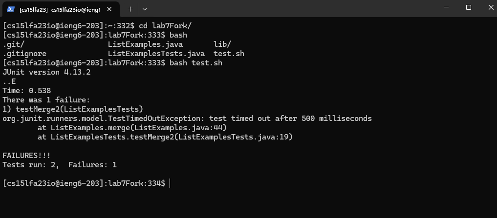

# LAB 4 ***Vim***
* **step 4:** ***Log into ieng6***
    
    * `ssh ieng6.ucsd.edu <enter>` logs into the ieng6 server using ssh leveraging my ssh config file to handle specifying the user and identity file, enter to submit the line to the terminal. Did not use any keyboard short cuts just typed out the entire command.
* **step 5:** ***Clone your fork of the repository from your Github account***
    
    * `git clo<tab> <r-mouse-click><enter>` calls git with the clone sub command using tab to auto fill the rest of word to speed up typing the command, and right mouse click was used to handle pasting the git url into the terminal, cool feature of windows terminal, enter to submit the line to the terminal 
* **step 6:** ***Run the tests, demonstrating that they fail***

    * `cd lab7<tab><enter>` followed by `bash <tab><tab> test<tab><enter>` cd into the newly created directory by git using tab auto complete. Followed by typing in `bash` followed by two `<tab>` to list the files into the terminal, then filling in with ` test<tab>` to autocomplete the file extension. `<enter>` again was used to submit the line to the terminal.
* **step 7:** ***Edit the code file to fix the failing test***

    * `vim List<tab>.<tab><enter>` to open the ListExamples files in the vim editor, used `<tab>` initially to fill up to first conflicting file name and then type `.` to specify the non-test java file and then used `<tab>` to fill the java extension, and then `<enter>` to submit the line.
    * `<shift+;>40<enter>4j7lr2<esc><shift+;>wq<enter>` to break this down I first jump to line 40 using `<shift+;>40<enter>` in the `ListExamples.java` file, which puts the at the end of the `index1` while loop. I then drop 4 lines down using `4j`, which follow with shifting the cursor to right 7 character to point to the end of `index1` using `7l`. I then replace in place using `r` immediately followed with `2` to change `index1` to `index2`. I then exit to normal mode using `<esc>`, and then exit vim and saving file using `<shift+;>wq`.
* **step 8:** ***Run the tests, demonstrating that they now succeed***

    * `<up><up><enter>` `<up><up>`, as it was used 2 commands ago, was used to load the `bash test.sh` command from history to run the test script and `<enter>` was used to submit that command to the console.
* **step 9:** ***Commit and push the resulting change to your Github account***

    * `git add List<tab> && git comm<tab> -m "passed all tests" && git pu<tab><enter>` this string of commands adds the modified version of ListExamples.java to stage changes of the next commit and `<tab>` was used to autocomplete to `Examples.java`. I used `&&` as a way to strings commands to be run back to back with out needing to run them sequentially in order which helps reduce waiting for a command to finish so you can type in the next command. `git comm<tab> -m "passed all tests"` was used to create a commit with the current stage changes with the message `passed all tests`, `<tab>` was used to complete to `commit`. Finally `git pu<tab>` was used to push that commit to the repo with my git ssh key, `<tab>` again was used to complete the command to `push` and `<enter>` was used to submit the entire line to the console.