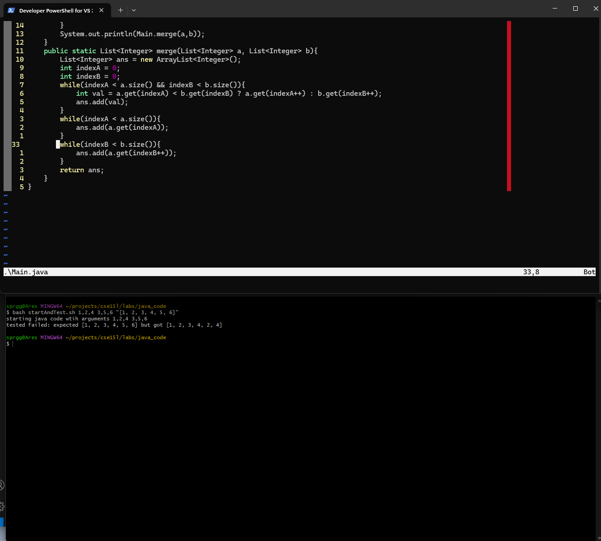
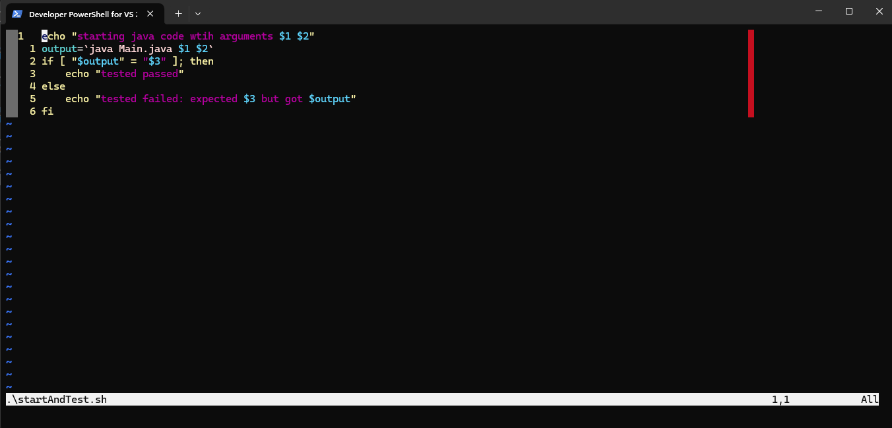
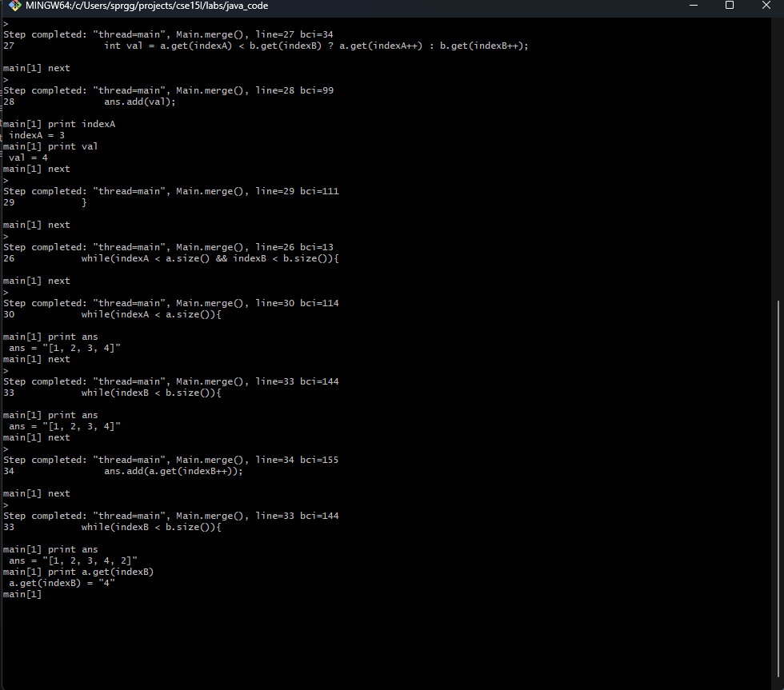
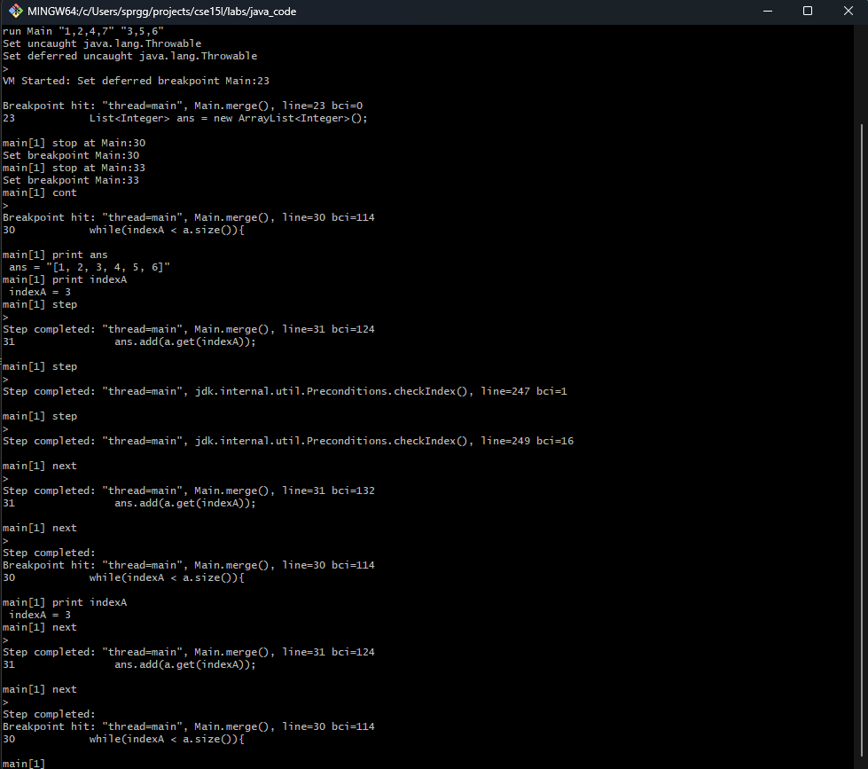

# LAB 5 Putting it all together 
## EdStem post discourse
* Initial student post \
    Hi, I was creating the implementation of the merge algorithm assigned in class and I keep failing the test. Here is my output of running the program along with my source code and bash script file. I am not sure where to start any guidance would be appreciated.
    
    
* TA Initial response
    Hi student, For some initial guidance in fixing this issue you can look into using JDB to further analyze your program. To give further help pay attention to what is copied correctly into the output array, and what elements have been exhausted after the first loop. These might be good things to think about when you proceed to debug your program with JDB. Final quick tip remember to use JDB the source code needs to be compiled with the -g flag to allow for extra program information.
* Student follow-up response
    Hi TA, thanks for the response. I was able to use JDB to help debug my program where I found two bugs. They were as you pointed out not related to the main loop but the two sub-loops both of which contained unrelated bugs. The first one was related to the initial input where list `a` would be exhausted first, and would run the sub-loop for list `b`. In that sub-loop, it turned out I made a simple typo where I used the wrong list `a` instead of `b`, which explains why the contents of list `a` were copied twice for the reaming size of list b, as shown by the JDB print outs. The second Bug was only found after I decided to test the other case where list `b` is exhausted first. In that case, an infinite loop occurred because I did not increment the `indexA` variable in that sub-loop, meaning the while loop condition remained true.
    
    
* Debrief
    * File Structure
        ```
        java_code
        ┠────debug.sh
        ┠────Main.class
        ┠────Main.java
        ┠────startAndTest.sh
        ````
    * Contents of files
        * Main.java
            ```java
                import java.util.List;
                import java.util.ArrayList;
                import java.util.Arrays;
                public class Main{
                    public static void main(String args[]){ 
                        List<Integer> a = new ArrayList<>();
                        List<Integer> b = new ArrayList<>();
                        int indexer = 0;
                        for(String ele: args){
                            String[] spliter = ele.split(",");
                            for(String subEle: spliter){
                                if(indexer%2 == 0){
                                    a.add(Integer.parseInt(subEle));
                                }else{
                                    b.add(Integer.parseInt(subEle));
                                }
                            }
                            indexer++;
                        }
                        System.out.println(Main.merge(a,b));
                    }
                    public static List<Integer> merge(List<Integer> a, List<Integer> b){
                        List<Integer> ans = new ArrayList<Integer>();
                        int indexA = 0;
                        int indexB = 0;
                        while(indexA < a.size() && indexB < b.size()){
                            int val = a.get(indexA) < b.get(indexB) ? a.get(indexA++) : b.get(indexB++);
                            ans.add(val);
                        }
                        while(indexA < a.size()){
                            ans.add(a.get(indexA));
                        }
                        while(indexB < b.size()){
                            ans.add(a.get(indexB++));
                        }
                        return ans;
                    }
                }
            ```
        * startAndTest.sh
            ```bash
                echo "starting java code with arguments $1 $2"
                output=`java Main.java $1 $2` #assumes >= jdk11
                if [ "$output" = "$3" ]; then
                    echo "tested passed"
                else
                    echo "tested failed: expected $3 but got $output"
                fi
            ```
        * debug.sh
            ```bash 
                javac -g Main.java
                jdb Main $1 $2
            ```
    * Commands used to run the program and debug the program
        * bash startAndTest.sh 1,2,4 3,5,6 "[1, 2, 3, 4, 5, 6]"
        * bash debug.sh 1,2,4 3,5,6
            * In jdb
                * stop at Main:23
                * stop at Main:30
                * stop at Main:33
                * run
                * ...
                * exit
    * Description to fix bugs
        * To fix the first noted bug the user needs to change line 34 from `a.get(indexB++)` to `b.get(indexB++)`. This changes the behavior from copying from list `a` to that of copying from list `b`.
        * The last bug fix is on line 27 where the user needs to change `a.get(indexA)` to `a.get(indexA++)` to make sure to update `indexA` index position. This fixes the infinite loop bug and allows the program to operate normally.


## Part2 Reflection
The second half of this class has taught me several things that I did not know before. One of them was `grep`, which I did know some of, but not to the level I know now. I learned how to use `grep` effectively by learning extended grep patterns, as well as inverse matching, along with grep usage alongside `awk` and `sed`. I have completely gained an appreciation for command line tools like `grep`, which seem simple but are super complex and have tons of use cases. The other final thing I learned through the second part of this course was `jdb`, which at first seemed a little silly to use as most IDEs provide debugging suites that provide much more utility. It was after I started to use it that it started to make more sense, like what if I am debugging a program in a non-developer environment like a server or another remote application, or what if space, where I don't need to have an IDE open, then starting an IDE just to have a debugger, seems like a waste and also slows down developer efficiently.
